# Habit Shaper

Shaping is hard. Habit Shaper helps you make it 1% better every day by turning small actions into visible progress. Build what helps, break what holds you back, and keep moving without losing the work you already did.

## Quick start

```sh
docker compose up
```

| Open         | URL                                      |
| ------------ | ---------------------------------------- |
| Application  | <http://localhost:3000>                  |
| Swagger UI   | <http://localhost:3000/api/docs>         |
| OpenAPI JSON | <http://localhost:3000/api/openapi.json> |
| Health check | <http://localhost:3000/api/health>       |

Use the seeded account:

| Field    | Value                     |
| -------- | ------------------------- |
| Email    | `demo@habit-shaper.local` |
| Password | `demo-password`           |

### Seed data

The demo seed runs automatically when the app container starts. It is repeatable, so running it again updates the demo account without duplicating its records.

| Task                         | Command                                                            |
| ---------------------------- | ------------------------------------------------------------------ |
| Run seed manually            | `docker compose exec app npm run seed`                             |
| Start without automatic seed | Set `SEED_DEMO_DATA=false` in `.env`, then run `docker compose up` |
| Reset all local data         | `docker compose down -v` then `docker compose up`                  |
| Override demo login          | Set `DEMO_EMAIL` and `DEMO_PASSWORD` in `.env`                     |

`docker compose down -v` permanently removes the local database volume.

## Showcase

| Feature      | Preview                                                                                 |
| ------------ | --------------------------------------------------------------------------------------- |
| Landing      | 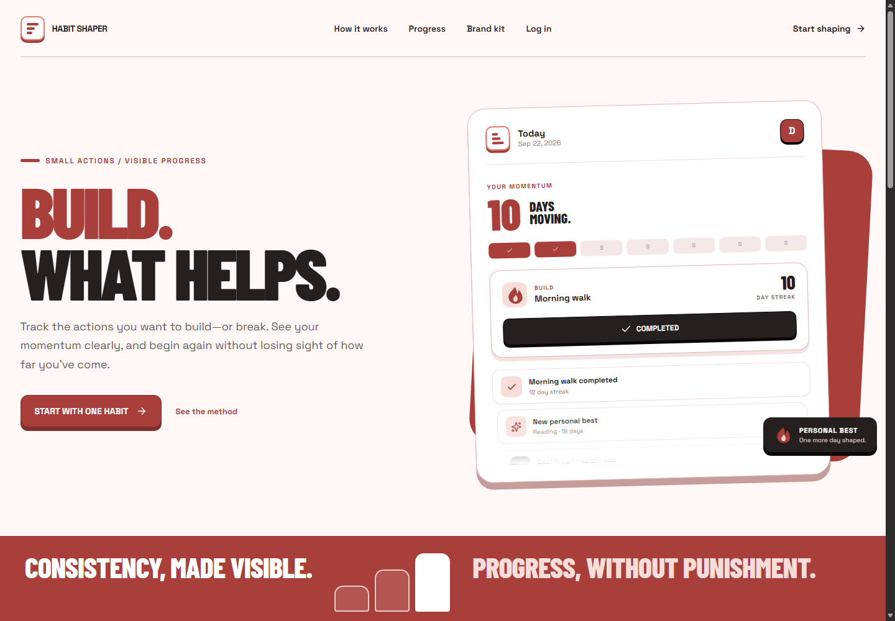                          |
| Today        | 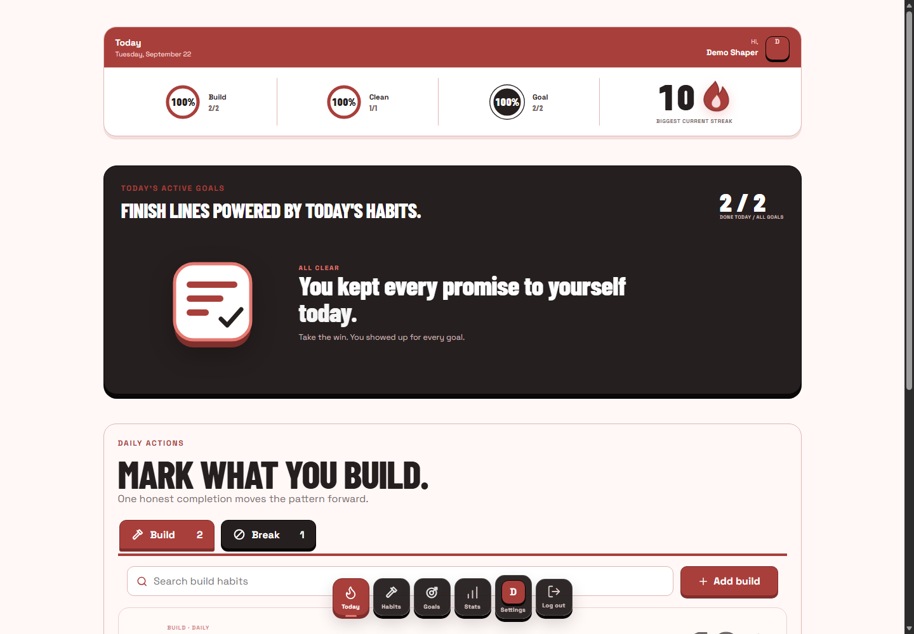             |
| Habits       | 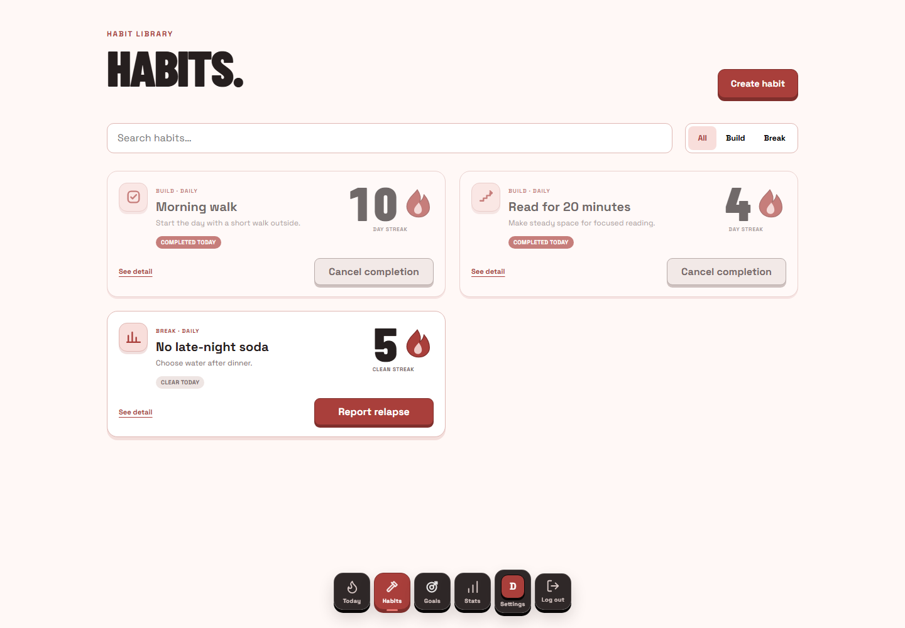                       |
| Habit detail | 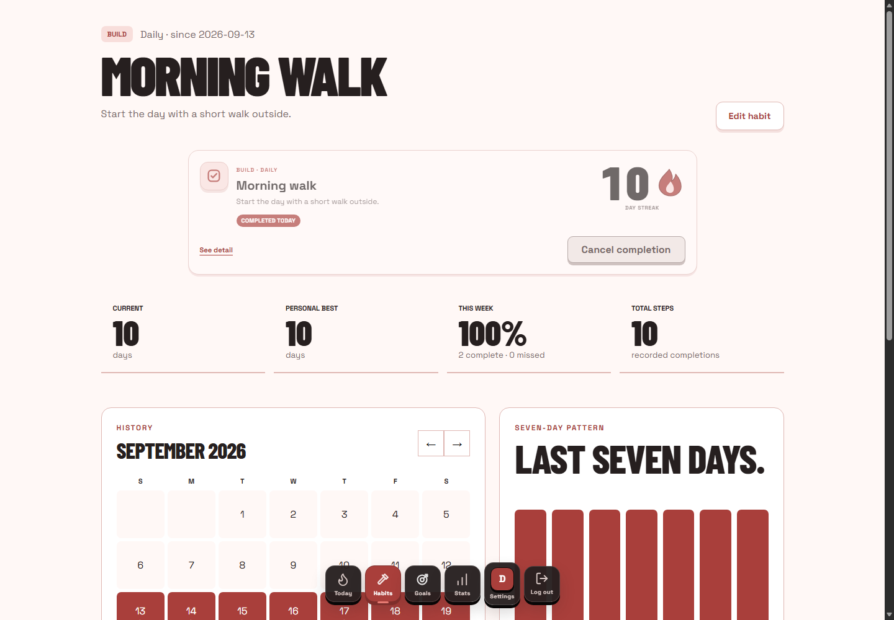 |
| Create habit | 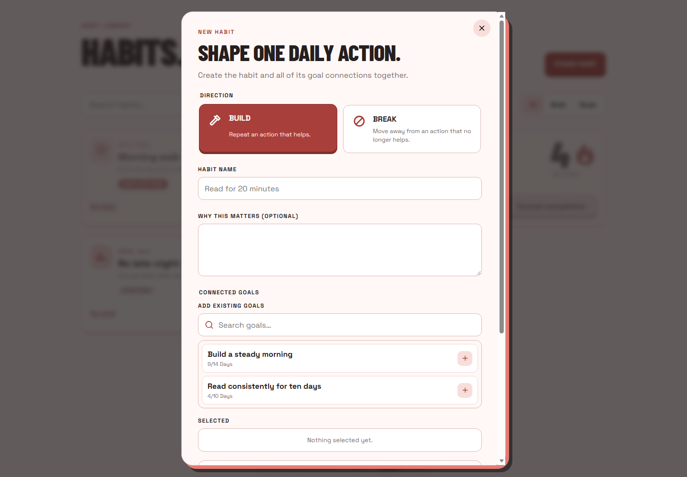   |
| Goals        | 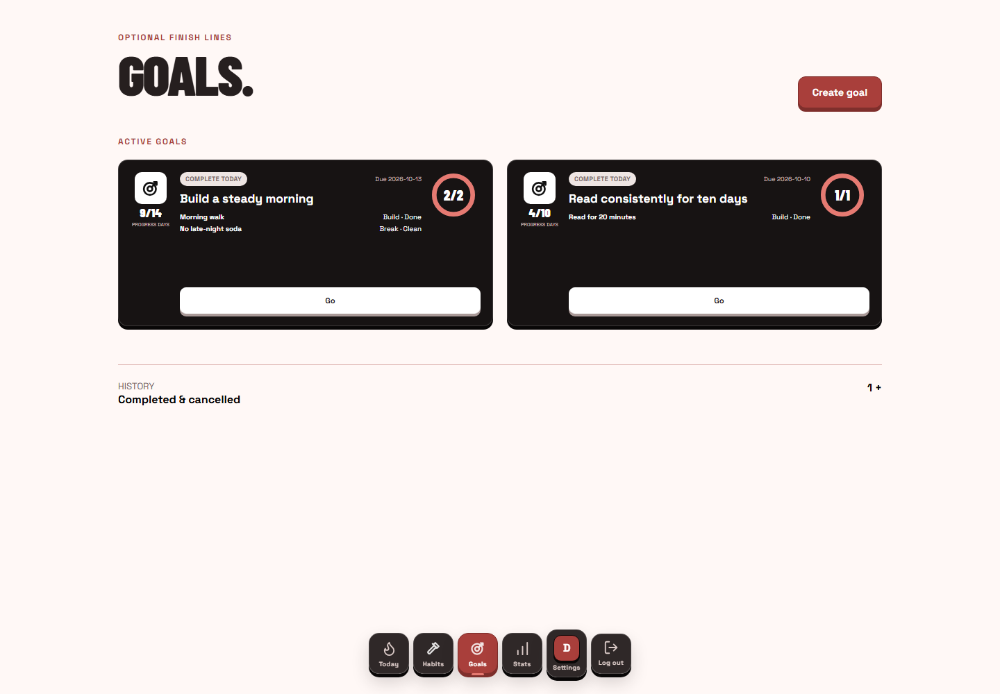                            |
| Goal detail  | 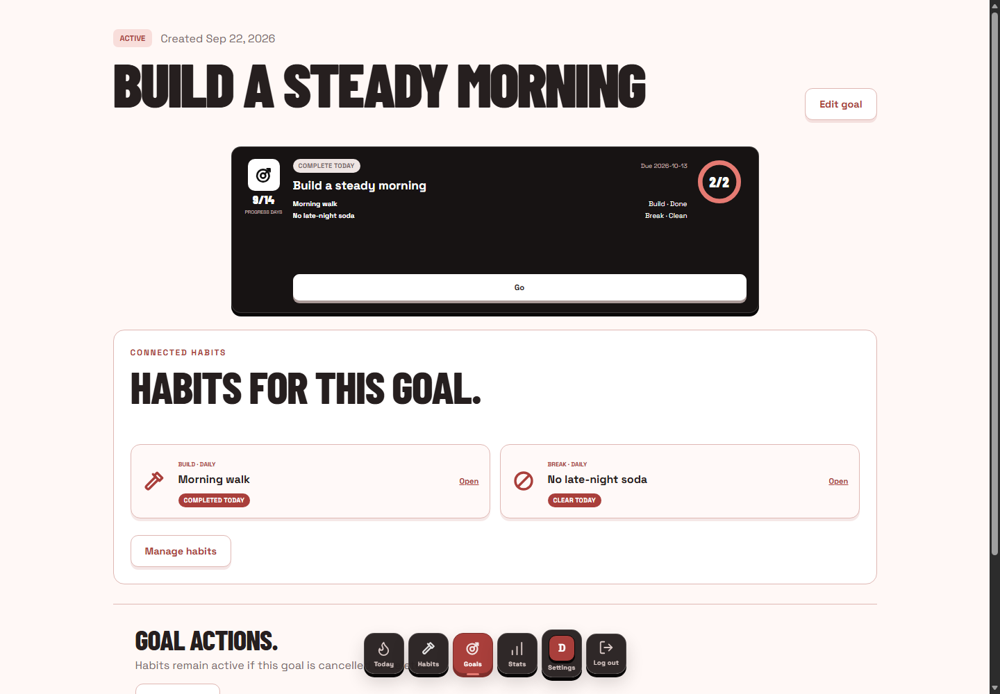              |
| Statistics   | 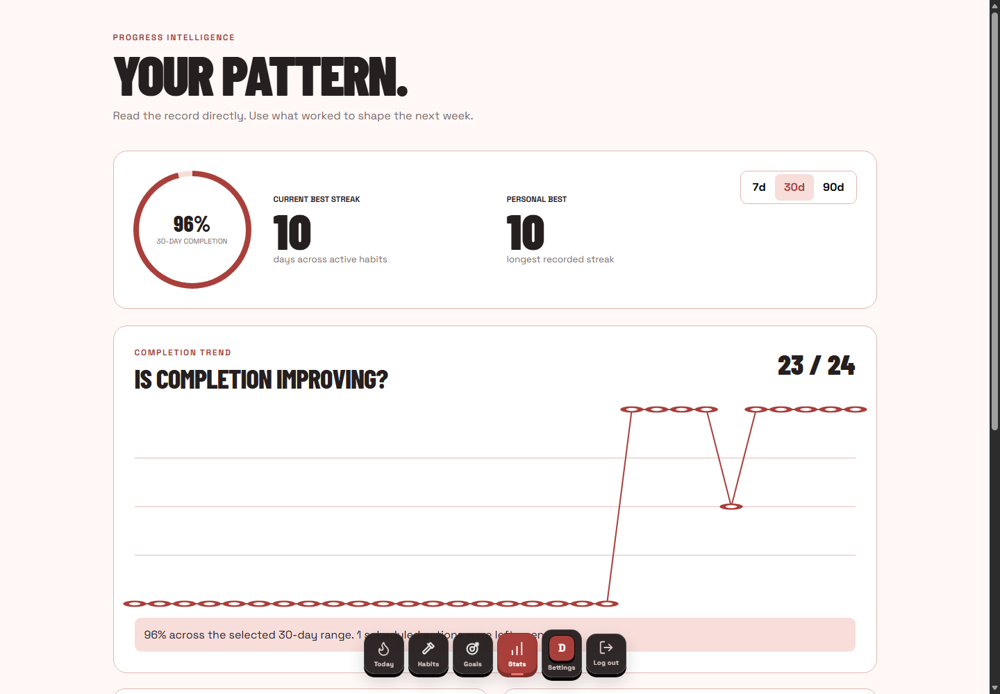           |
| Settings     | 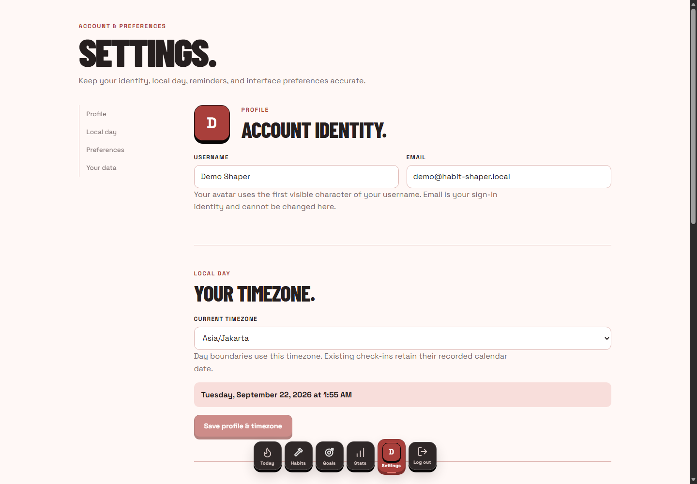   |

## Features

| Feature           | What it does                                             | Why it matters                                 |
| ----------------- | -------------------------------------------------------- | ---------------------------------------------- |
| Build habits      | Records positive actions as daily completions            | Makes consistency visible                      |
| Break habits      | Records relapses and clean-day recovery                  | Keeps setbacks useful instead of destructive   |
| Today dashboard   | Places every daily action and active goal in one view    | Reduces the work needed to check in            |
| Habit composer    | Stages existing and new goals before one atomic save     | Prevents partial habit and goal data           |
| Goal composer     | Stages existing and new habits before one atomic save    | Keeps goal setup predictable                   |
| Goal progress     | Derives progress from connected habit activity           | Connects daily action to a clear target        |
| Statistics        | Shows streaks, weekly rates, totals, and relapse history | Turns activity into feedback                   |
| Achievement chips | Shows concise feedback after meaningful events           | Rewards progress without blocking the workflow |
| Data export       | Downloads account, habit, event, and goal data           | Keeps user data portable                       |
| Timezone support  | Evaluates local dates using the account timezone         | Keeps daily tracking accurate                  |

### Gamification events

| Event                 | Trigger                                     | Level     | UI response        |
| --------------------- | ------------------------------------------- | --------- | ------------------ |
| `HABIT_CREATED`       | A habit is created                          | Micro     | Creation chip      |
| `FIRST_CHECK_IN`      | First build completion                      | Progress  | Progress chip      |
| `DAILY_COMPLETION`    | A build habit is completed                  | Micro     | Completion chip    |
| `STREAK_STARTED`      | A new sequence begins                       | Progress  | Progress chip      |
| `STREAK_MILESTONE`    | 3, 7, 14, 30, 60, or 100 days               | Milestone | Milestone chip     |
| `PERSONAL_BEST`       | A previous best is exceeded                 | Milestone | Personal best chip |
| `GOAL_HALFWAY`        | Goal reaches 50 percent                     | Progress  | Goal chip          |
| `GOAL_NEARLY_REACHED` | Goal is close to its target                 | Progress  | Goal chip          |
| `GOAL_COMPLETED`      | Goal target is reached                      | Milestone | Completion chip    |
| `PERFECT_WEEK`        | Every eligible day is completed             | Milestone | Weekly chip        |
| `RELAPSE_RECORDED`    | A break habit relapse is recorded           | Recovery  | Recovery chip      |
| `COMEBACK`            | A build habit resumes after at least 3 days | Recovery  | Comeback chip      |

## Architecture

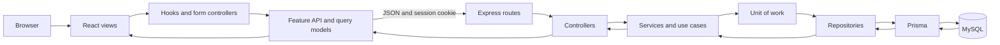

| Layer                                       | MVC role      | Responsibility                                        |
| ------------------------------------------- | ------------- | ----------------------------------------------------- |
| React pages and components                  | View          | Render state, forms, feedback, and navigation         |
| Hooks, forms, and query mutations           | Controller    | Translate user actions into validated operations      |
| Domain types, API adapters, and query cache | Model         | Represent frontend data and server state              |
| Express routes and controllers              | Controller    | Authenticate, validate, and map HTTP input and output |
| Services and use cases                      | Model         | Apply business rules and transaction boundaries       |
| Repositories and Prisma                     | Model         | Isolate persistence and ownership-scoped queries      |
| Shared request and response contracts       | Communication | Keep frontend and backend payloads aligned            |

Habit and goal composition writes run in one Prisma transaction. A failed root write, draft creation, connection update, disconnection, or progress reconciliation rolls back the full operation.

## Design philosophy

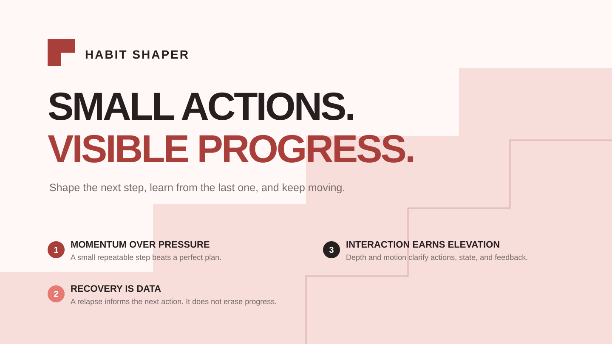

| Principle                   | Product rule                                                            |
| --------------------------- | ----------------------------------------------------------------------- |
| Momentum over pressure      | Make the next useful action obvious and small                           |
| Recovery is data            | Preserve history and use relapse information to guide recovery          |
| Interaction earns elevation | Use borders, shadows, and motion only when they clarify action or state |
| Progress stays visible      | Put current state, next action, and long-term direction together        |
| Feedback stays lightweight  | Use chips for achievements instead of blocking overlays                 |

## Tech stack

| Technology       | Role                 | Why it is used                                               |
| ---------------- | -------------------- | ------------------------------------------------------------ |
| React 19         | User interface       | Composable feature views and predictable rendering           |
| TypeScript 5.9   | Application language | Shared, checked contracts across the stack                   |
| Vite 7           | Frontend tooling     | Fast development and production bundling                     |
| React Router 7   | Navigation           | Nested protected routes and lazy feature boundaries          |
| TanStack Query 5 | Server state         | Cache, invalidation, loading, and retry behavior             |
| React Hook Form  | Form state           | Small rerender surface for validated forms                   |
| Zod 4            | Runtime validation   | One source for API and form constraints                      |
| Motion           | UI feedback          | Focused transitions and progress feedback                    |
| Express 5        | HTTP server          | Routes, middleware, cookies, and frontend delivery           |
| Prisma 6.19      | Data access          | Typed queries, migrations, and atomic transactions           |
| MySQL 8.4        | Database             | Relational ownership, history, and progress data             |
| OpenAPI 3.1      | API contract         | Machine-readable endpoint documentation                      |
| Swagger UI       | API explorer         | Browser-based request and response inspection                |
| Vitest           | Test runner          | Unit and integration tests across workspaces                 |
| Testing Library  | Frontend tests       | User-focused component behavior                              |
| Supertest        | Backend tests        | HTTP behavior without a separate test server                 |
| Docker Compose   | Runtime setup        | Starts the application and database from the repository root |

## Database model

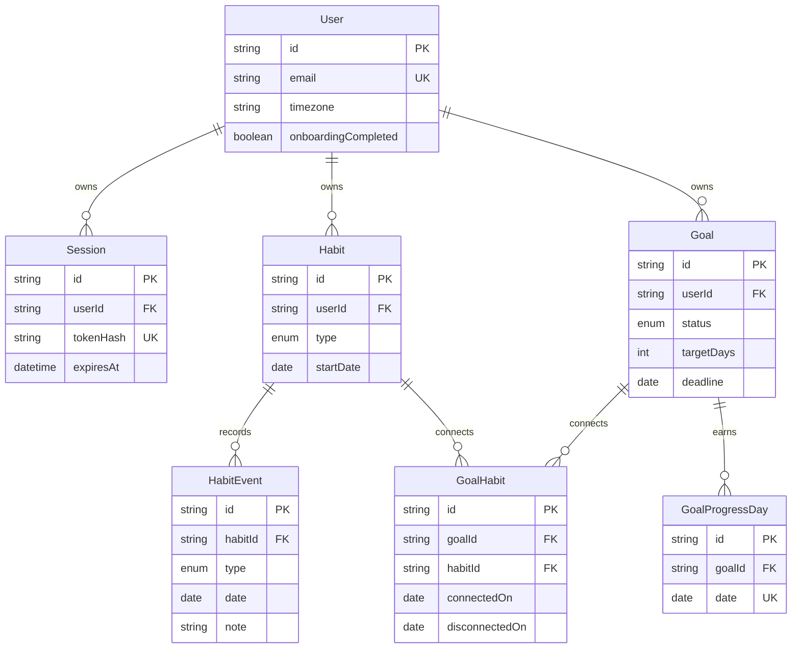

| Model             | Stores                                                  |
| ----------------- | ------------------------------------------------------- |
| `User`            | Login identity, profile, timezone, and onboarding state |
| `Session`         | Hashed opaque login tokens and expiry                   |
| `Habit`           | Build or break habit definition                         |
| `HabitEvent`      | Completion or relapse on one local calendar date        |
| `Goal`            | Target, deadline, status, and final progress            |
| `GoalHabit`       | Time-aware habit and goal connections                   |
| `GoalProgressDay` | Reconciled days that count toward a goal                |

## User flow

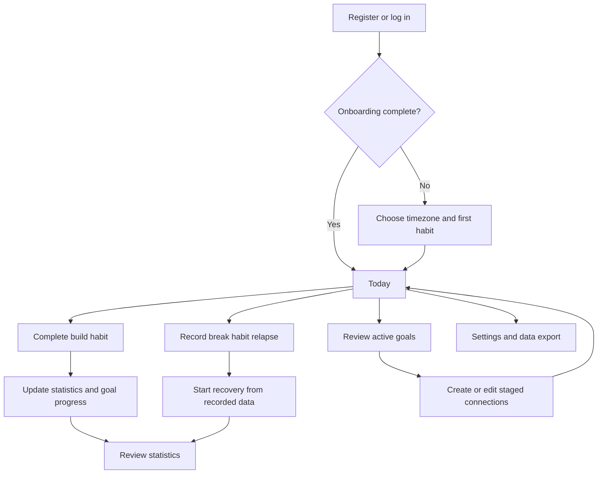

| Stage    | Main action                                    | Result                                 |
| -------- | ---------------------------------------------- | -------------------------------------- |
| Start    | Register, log in, and set timezone             | Local calendar behavior is established |
| Shape    | Create build or break habits and connect goals | The daily plan is ready                |
| Check in | Complete or record a relapse from Today        | History and progress update together   |
| Recover  | Review relapse context and continue            | Previous work remains visible          |
| Review   | Open goals and statistics                      | Progress informs the next change       |

## API documentation

| Artifact        | Location                                 | Use                                      |
| --------------- | ---------------------------------------- | ---------------------------------------- |
| Swagger UI      | <http://localhost:3000/api/docs>         | Explore endpoints and send requests      |
| OpenAPI JSON    | <http://localhost:3000/api/openapi.json> | Generate clients or inspect the contract |
| Health endpoint | <http://localhost:3000/api/health>       | Check application and database readiness |

Swagger is public, but protected operations still require the `habit_session` cookie. Log in through `POST /api/auth/login` in Swagger before trying protected endpoints.

## Security

| Control          | Implementation                                             |
| ---------------- | ---------------------------------------------------------- |
| Password storage | bcrypt with configurable work factor                       |
| Sessions         | Opaque random token; only its SHA-256 hash is stored       |
| Cookie           | `HttpOnly`, `SameSite=Lax`, and configurable `Secure`      |
| Login protection | Rate limits on registration and login                      |
| Input validation | Strict Zod schemas for body and path data                  |
| Request limit    | JSON body capped at 32 KB                                  |
| Authorization    | Every resource lookup is scoped to the authenticated owner |
| Atomic writes    | Prisma transactions roll back incomplete compositions      |
| Error output     | Structured public errors without database detail           |
| Observability    | Request IDs and structured server errors                   |

The defaults in `.env.example` are for local use. Replace credentials for a shared environment and never commit `.env`.

## Environment

| Variable              | Default                   | Purpose                                    |
| --------------------- | ------------------------- | ------------------------------------------ |
| `APP_PORT`            | `3000`                    | Host HTTP port                             |
| `MYSQL_PORT`          | `3306`                    | Host MySQL port                            |
| `MYSQL_DATABASE`      | `habit_shaper`            | Initial database name                      |
| `MYSQL_USER`          | `habit_shaper`            | Application database user                  |
| `MYSQL_PASSWORD`      | `scaffold_password`       | Local database password                    |
| `MYSQL_ROOT_PASSWORD` | `scaffold_root_password`  | Local root password                        |
| `BCRYPT_ROUNDS`       | `12`                      | Password hashing work factor from 10 to 15 |
| `SESSION_TTL_DAYS`    | `7`                       | Login lifetime from 1 to 90 days           |
| `COOKIE_SECURE`       | `false`                   | Require HTTPS for the session cookie       |
| `SEED_DEMO_DATA`      | `true`                    | Run the demo seed at container startup     |
| `DEMO_EMAIL`          | `demo@habit-shaper.local` | Seeded login email                         |
| `DEMO_PASSWORD`       | `demo-password`           | Seeded login password                      |

## Quality gates

| Check                       | Command                                               |
| --------------------------- | ----------------------------------------------------- |
| TypeScript                  | `npm run typecheck`                                   |
| Lint                        | `npm run lint`                                        |
| Formatting                  | `npm run format:check`                                |
| Unit and integration tests  | `npm test`                                            |
| Production build            | `npm run build`                                       |
| Full container test profile | `docker compose --profile test run --build --rm test` |
| Stack readiness             | `docker compose up -d --build --wait`                 |
| Health response             | `curl http://localhost:3000/api/health`               |

## Project map

| Path                      | Contains                                              |
| ------------------------- | ----------------------------------------------------- |
| `frontend/src/features`   | Feature views, forms, queries, and UI controllers     |
| `frontend/src/components` | Shared layout and interface components                |
| `backend/src/features`    | Routes, controllers, services, repositories, and DTOs |
| `backend/src/docs`        | Generated OpenAPI registry and response schemas       |
| `backend/prisma`          | Database schema, migrations, and demo seed            |
| `packages/contracts`      | Shared request and response TypeScript contracts      |
| `tests/smoke`             | Production stack smoke tests                          |
| `docs/readme`             | README screenshots and design assets                  |

## Common operations

| Task                       | Command                                |
| -------------------------- | -------------------------------------- |
| Start and rebuild          | `docker compose up --build`            |
| Start in background        | `docker compose up -d --build --wait`  |
| Follow logs                | `docker compose logs -f app db`        |
| Restart the app            | `docker compose restart app`           |
| Run demo seed              | `docker compose exec app npm run seed` |
| Stop services              | `docker compose down`                  |
| Stop and delete local data | `docker compose down -v`               |

## Glossary

| Artifact         | Description                                | How to use it                                   |
| ---------------- | ------------------------------------------ | ----------------------------------------------- |
| Build habit      | A positive action to repeat                | Mark it complete on an eligible day             |
| Break habit      | A behavior to reduce or stop               | Record a relapse with an optional reason        |
| Relapse          | A dated break-habit event                  | Use its context to plan recovery                |
| Goal             | A target number of successful days         | Connect one or more habits and track progress   |
| Composer         | A staged relationship editor               | Add, remove, or draft items, then save once     |
| Habit event      | A completion or relapse record             | Drives statistics and goal reconciliation       |
| Progress day     | A date earned by all connected habit rules | Counts toward an active goal                    |
| Achievement chip | Small event feedback                       | Confirms progress without interrupting the page |
| Demo seed        | Repeatable sample account and data         | Run automatically or with `npm run seed`        |
| OpenAPI spec     | Machine-readable HTTP contract             | Open `/api/openapi.json` or feed it to tooling  |
| Swagger UI       | Interactive API documentation              | Open `/api/docs`, log in, and try endpoints     |
| Data export      | JSON snapshot of owned records             | Download it from Settings or `GET /api/export`  |
